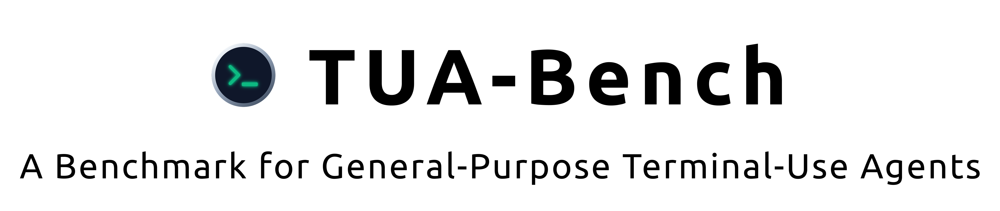
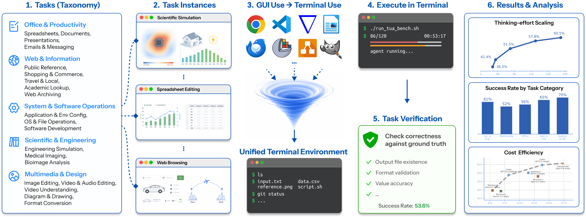

[](https://facebookresearch.github.io/TUA-Bench/)

<div align="center">

<a href="https://www.shoufachen.com">Shoufa Chen</a><sup>1,&ast;</sup>,
<a href="https://www.luyuan.wang">Luyuan Wang</a><sup>1,&ast;</sup>,
<a href="https://xuanyang19.github.io">Xuan Yang</a><sup>2</sup>,
<a href="https://johanan528.github.io">Zhiheng Liu</a><sup>1</sup>,
<a href="https://yrcong.github.io">Yuren Cong</a><sup>1</sup>,
<a href="https://jiyuanfeng.github.io">Yuanfeng Ji</a><sup>3</sup>,
<a href="https://zhoufeiyn.github.io">Feiyan Zhou</a><sup>1</sup>,
<a href="https://www.linkedin.com/in/xiaohui-zhang-79569539/">Xiaohui Zhang</a><sup>1</sup>,
<a href="https://www.linkedin.com/in/fanny-yang-035861128/">Fanny Yang</a><sup>1</sup>,
<a href="https://www.linkedin.com/in/belindazeng/">Belinda Zeng</a><sup>1</sup>

<sup>&ast;</sup>Equal contribution

</div>

<div align="center">

  

</div>

# 💻 TUA-Bench
TUA-Bench is a comprehensive benchmark featuring 120 real-world, execution-based tasks designed to evaluate general-purpose Terminal-Use Agents (TUAs) across everyday digital workflows and specialized scientific tools. By providing a broad and realistic evaluation of terminal-use capabilities, TUA-Bench aims to accelerate the transition from narrow, task-specific assistants to general-purpose agents capable of operating reliably across diverse digital environments.




# 🏆 Leaderboard

Benchmark results.

| Agent | Model | Thinking | Success Rate | Pass@1 | Pass@5 | All-5 |
| --- | --- | --- | --- | --- | --- | --- |
| Claude Code | `claude-opus-4.8` | `max` | **0.658 ± 0.007** | **58.8%** | 64.2% | **51.7%** |
| Codex | `gpt-5.5` | `xhigh` | 0.647 ± 0.007 | 57.7% | **68.3%** | 42.5% |
| Codex | `gpt-5.5` | `high` | 0.642 ± 0.007 | 57.2% | 66.7% | 46.7% |
| OpenHands SDK | `claude-opus-4.8` | `max` | 0.634 ± 0.006 | 57.3% | 67.5% | 45.0% |
| Mini-SWE-Agent | `gpt-5.5` | `xhigh` | 0.624 ± 0.008 | 54.2% | 67.5% | 40.0% |
| OpenHands SDK | `gpt-5.5` | `xhigh` | 0.614 ± 0.010 | 54.0% | 65.0% | 38.3% |
| Terminus-2 | `gpt-5.5` | `xhigh` | 0.601 ± 0.006 | 52.3% | 64.2% | 31.7% |
| Terminus-2 | `claude-opus-4.8` | `max` | 0.597 ± 0.010 | 53.8% | 62.5% | 42.5% |
| Codex | `gpt-5.5` | `medium` | 0.588 ± 0.010 | 51.2% | 62.5% | 34.2% |
| Terminus-2 | `claude-opus-4.7` | `max` | 0.580 ± 0.008 | 51.0% | 64.2% | 39.2% |
| Terminus-2 | `gpt-5.5` | `high` | 0.578 ± 0.017 | 49.8% | 63.3% | 32.5% |
| Mini-SWE-Agent | `claude-opus-4.8` | `max` | 0.574 ± 0.006 | 50.2% | 64.2% | 34.2% |
| Terminus-2 | `claude-opus-4.7` | `xhigh` | 0.554 ± 0.008 | 48.0% | 59.2% | 37.5% |
| Terminus-2 | `gpt-5.5` | `medium` | 0.515 ± 0.013 | 42.8% | 62.5% | 21.7% |
| Claude Code | `claude-opus-4.7` | `xhigh` | 0.503 ± 0.010 | 43.0% | 57.5% | 29.2% |
| Claude Code | `claude-opus-4.7` | `max` | 0.501 ± 0.006 | 42.8% | 55.8% | 30.8% |
| Terminus-2 | `claude-opus-4.7` | `high` | 0.499 ± 0.012 | 42.5% | 58.3% | 25.0% |
| Terminus-2 | `claude-opus-4.7` | `none` | 0.497 ± 0.011 | 41.7% | 58.3% | 27.5% |
| Terminus-2 | `gemini-3.1-pro-preview` | `high` | 0.493 ± 0.018 | 41.2% | 57.5% | 24.2% |
| Mini-SWE-Agent | `gemini-3.1-pro-preview` | `none` | 0.485 ± 0.015 | 40.0% | 57.5% | 20.8% |
| Terminus-2 | `glm-5.1` | `xhigh` | 0.481 ± 0.013 | 40.3% | 59.2% | 20.8% |
| Claude Code | `claude-opus-4.7` | `high` | 0.474 ± 0.004 | 40.7% | 54.2% | 27.5% |
| Terminus-2 | `minimax-m3` | `xhigh` | 0.470 ± 0.013 | 41.2% | 59.2% | 22.5% |
| Codex | `gpt-5.5` | `low` | 0.467 ± 0.011 | 39.0% | 61.7% | 20.0% |
| Terminus-2 | `deepseek-v4-pro` | `xhigh` | 0.462 ± 0.008 | 38.0% | 57.5% | 18.3% |
| Terminus-2 | `claude-opus-4.7` | `medium` | 0.457 ± 0.007 | 37.8% | 51.7% | 23.3% |
| Claude Code | `claude-opus-4.7` | `none` | 0.450 ± 0.011 | 37.7% | 50.8% | 24.2% |
| Terminus-2 | `qwen3.7-max` | `xhigh` | 0.449 ± 0.007 | 37.7% | 57.5% | 21.7% |
| OpenHands SDK | `gemini-3.1-pro-preview` | `none` | 0.441 ± 0.015 | 35.8% | 56.7% | 19.2% |
| Terminus-2 | `claude-sonnet-4.6` | `max` | 0.428 ± 0.003 | 34.8% | 49.2% | 20.0% |
| Terminus-2 | `kimi-k2.6` | `xhigh` | 0.428 ± 0.018 | 35.3% | 55.8% | 18.3% |
| Terminus-2 | `gpt-5.5` | `low` | 0.424 ± 0.017 | 33.5% | 51.7% | 13.3% |
| Claude Code | `claude-opus-4.7` | `medium` | 0.417 ± 0.006 | 34.8% | 50.8% | 19.2% |
| Terminus-2 | `claude-opus-4.7` | `low` | 0.412 ± 0.010 | 32.7% | 45.8% | 21.7% |
| Terminus-2 | `gpt-5.5` | `none` | 0.365 ± 0.008 | 28.2% | 45.0% | 14.2% |
| Claude Code | `claude-opus-4.7` | `low` | 0.353 ± 0.003 | 28.3% | 40.8% | 16.7% |
| Codex | `gpt-5.5` | `none` | 0.350 ± 0.009 | 26.2% | 49.2% | 8.3% |
| Terminus-2 | `gpt-5.4-mini` | `xhigh` | 0.272 ± 0.014 | 20.0% | 41.7% | 6.7% |
| Terminus-2 | `claude-haiku-4.5` | `none` | 0.239 ± 0.015 | 15.7% | 30.8% | 3.3% |

# 💻 Setup
1. Install [Docker](https://www.docker.com/) or [Podman](https://podman.io/) for the containerized task execution environment.
2. Set up accounts with an LLM provider like OpenAI, Anthropic, or Google.
3. Run this command before running tasks to download assets:
   ```bash
   uv run setup-env
   ```

> [!IMPORTANT]
> Run `uv run setup-env` before the first benchmark run and after pulling updates that change tasks or assets. Some required benchmark files are downloaded/generated and are not committed to the repository.

To remove downloaded/generated benchmark assets and return the working tree to the data-clean state:
```bash
uv run setup-env --reset
```

> [!WARNING]
> `uv run setup-env --reset` deletes downloaded/generated benchmark assets. Run `uv run setup-env` again before launching tasks.

# 🚀 Quick Start
## Set LLM API Key

Example - set the OpenAI API key:

```bash
export OPENAI_API_KEY=<your_openai_api_key>
```

To use other LLM providers, set the corresponding environment variable:
- `ANTHROPIC_API_KEY` for Claude models.
- `GEMINI_API_KEY` for Gemini models.

## Run Tasks

Example - Run the benchmark tasks with Terminus-2, GPT-5.5 (xhigh thinking effort), and the Docker backend.

```bash
uv run harbor run \
  -p tasks \
  -a terminus-2 \
  -m openai/gpt-5.5 \
  --agent-kwarg use_responses_api=true \
  --agent-kwarg reasoning_effort=xhigh \
  -o jobs/tua-bench-run \
  --yes
```

> [!TIP]
> Use a new `-o jobs/...` output directory for each benchmark run to keep logs, artifacts, and results from different runs separate.

To use the Podman backend, add `--environment-import-path repo_env.podman_env:PodmanEnvironment` to the command above.


# 📚 Citation
If you find this project useful, please use the following BibTeX entry.

```bibtex
@article{chen2026tua,
  title={TUA-Bench: A Benchmark for Terminal-Use Agents},
  author={Chen, Shoufa and Wang, Luyuan and Yang, Xuan and Liu, Zhiheng and Cong, Yuren and Ji, Yuanfeng and Zhou, Feiyan and Zhang, Xiaohui and Yang, Fanny and Zeng, Belinda},
  journal={arXiv preprint arXiv:XXXX.XXXXX},
  year={2026}
}
```

# ⚖️ License
TUA-Bench is distributed under the terms of the Creative Commons Attribution-NonCommercial (CC BY-NC) license.

The dataset is intended for benchmarking purposes only. Third party content pulled from other locations are subject to its own licenses and you may have other legal obligations or restrictions that govern your use of that content.
